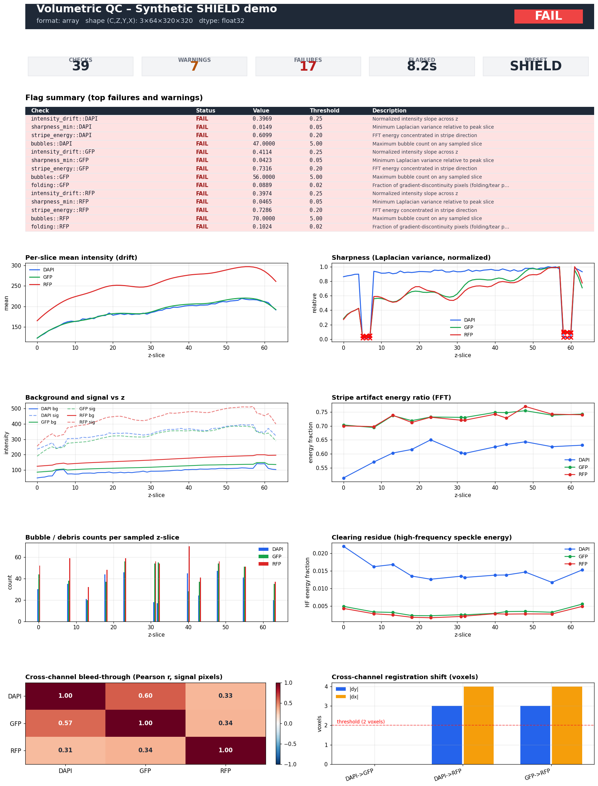

# volumetric-qc

**Automated quality control and artifact detection for terabyte-scale 3D fluorescence microscopy volumes.**

`volumetric-qc` is a Python toolkit for objectively assessing the quality of large cleared-tissue light-sheet datasets — SHIELD, iDISCO+, CLARITY, and similar — before they enter downstream analysis. It loads volumes lazily via OME-Zarr / dask, runs a battery of per-channel and cross-channel metrics, and produces both a machine-readable JSON summary and a self-contained HTML dashboard for human review.



*A real dashboard produced by `volumetric-qc` running on a synthetic SHIELD-style volume into which seven artifact families have been injected. Generated by `python scripts/generate_demo_dashboard.py` — fully reproducible.*

---

## Why this exists

Modern tissue-clearing methods routinely produce **terabytes per sample**. SHIELD (Park et al., 2018), iDISCO+ (Renier et al., 2016), and CLARITY (Chung et al., 2013) make whole-organ 3D imaging tractable, but each method has characteristic failure modes:

* **Intensity drift along z** — bleaching during the long acquisition, refractive-index mismatch attenuating signal at depth.
* **Channel bleed-through** — spectral overlap between fluorophores, particularly aggressive with autofluorescent lipids.
* **Cross-channel registration drift** — sub-micron differences in optical paths across wavelengths.
* **Stripe artifacts** — light-sheet illumination shadows behind absorbing features.
* **Bubbles, dust, and debris** — air pockets in immersion media, particulate contamination.
* **Folds and tears** — sample handling damage that produces sharp gradient discontinuities.
* **Residual lipid speckle** — incomplete clearing, RI mismatch at the sample/medium interface.
* **Out-of-focus z-slices** — focus drift over a multi-day acquisition.

These artifacts **silently corrupt downstream analysis**: cell counting will over- or under-count in stripe-contaminated regions, connectivity metrics will be skewed by registration drift, atlas alignment will fail on folded slices. Manual QC by eye does not scale to TB volumes, is observer-dependent, and is impossible to apply uniformly across a multi-hundred-sample experiment.

`volumetric-qc` runs the same battery of objective checks on every volume in a study, flags samples that fall outside per-modality acceptance thresholds, and produces a permanent QC record alongside the raw data.

---

## Quickstart

```bash
pip install volumetric-qc
```

Three-line example on a public OME-Zarr volume:

```python
from volumetric_qc import open_volume, run_qc, load_preset
result = run_qc(open_volume("path/to/sample.zarr"), load_preset("shield"))
from volumetric_qc.reports import write_html_report
write_html_report(result, "qc_dashboard.html")
```

Equivalent CLI:

```bash
volumetric-qc run path/to/sample.zarr --preset shield --output qc/
# Writes qc/qc_dashboard.html and qc/qc_summary.json
```

Batch a directory of samples and detect outlier samples across the batch:

```bash
volumetric-qc batch path/to/study/ --preset idisco --output qc/
# Writes per-sample dashboards + qc/batch_outliers.json with PCA / UMAP embeddings
```

---

## Key features

| Feature | What it does |
| --- | --- |
| **Lazy chunked I/O** | OME-Zarr, OME-TIFF, and NIfTI are loaded as `dask.array` — the full TB volume is never materialized in RAM. Metrics stream through z-slabs. |
| **Per-channel + cross-channel metrics** | 9 metric families covering intensity drift, focus, background uniformity, autofluorescence, channel bleed-through, registration, stripes, bubbles, folding, clearing residue. |
| **Modality presets** | `shield`, `idisco`, `clarity`, `generic` — each preset ships with thresholds tuned to that method's characteristic failure profile. |
| **YAML config** | Override any threshold or sampling parameter from a project-specific `qc_config.yaml`. |
| **JSON + HTML output** | The JSON summary is the source of truth for programmatic downstream work; the HTML dashboard is a self-contained file (no server, no external JS) for human review and archival. |
| **Batch outlier detection** | PCA, UMAP, and IsolationForest on per-sample summary vectors flag the one bad sample out of a batch of 200. |
| **Synthetic artifact injection** | `volumetric_qc.synthetic` injects known artifacts into clean volumes so you can unit-test metric sensitivity and tune thresholds for your own pipeline. |

---

## Installation

```bash
pip install volumetric-qc                # core
pip install "volumetric-qc[viewer]"      # adds napari for interactive 3D inspection
pip install "volumetric-qc[dev]"         # pytest, ruff, mypy, kaleido for screenshots
```

Python 3.11+. Core dependencies: numpy, scipy, scikit-image, scikit-learn, zarr, ome-zarr, dask, tifffile, nibabel, pydantic, plotly, typer, umap-learn.

---

## Metric reference (short)

Detailed explanations and references for every metric live in [docs/metrics_reference.md](docs/metrics_reference.md).

| Metric | What it catches |
| --- | --- |
| **intensity_drift** | Bleaching across z, depth-dependent attenuation. |
| **intensity_cv** | Excessive slice-to-slice intensity variability. |
| **sharpness** | Out-of-focus z-slices (per-slice Laplacian variance). |
| **background_uniformity** | Vignetting, uneven illumination, residual lipid pockets. |
| **autofluorescence** | Signal-to-background ratio is too low to call cells reliably. |
| **channel_bleed** | Spectral overlap between fluorophores (Pearson r on signal pixels). |
| **registration** | Cross-channel pixel shifts via sub-pixel phase correlation. |
| **stripes** | Light-sheet shadow stripes (FFT energy concentrated in stripe wedges). |
| **bubbles** | Air pockets and debris (Laplacian-of-Gaussian blob detection). |
| **folding** | Tissue folds and tears (gradient-discontinuity outlier fraction). |
| **clearing_residue** | Incomplete clearing, RI-mismatch speckle (high-frequency FFT energy). |

---

## Extending: writing a custom metric

A QC metric is a function that takes a `(Z, Y, X)` dask array (per channel) or a `LazyVolume` (cross-channel) and returns a JSON-serializable dict with `per_slice` arrays and `summary` scalars. To register a custom check:

```python
# my_metrics.py
import dask.array as da
import numpy as np

def saturation_fraction(zyx: da.Array, *, threshold: int = 65000) -> dict:
    """Fraction of pixels at sensor saturation, per z-slice."""
    fractions = []
    for z in range(zyx.shape[0]):
        sl = np.asarray(zyx[z].compute())
        fractions.append(float((sl >= threshold).mean()))
    return {"z": list(range(zyx.shape[0])),
            "saturation_fraction": fractions,
            "max_saturation": max(fractions)}
```

Then wire it into a run-time loop after `run_qc`:

```python
from volumetric_qc import open_volume, run_qc
from volumetric_qc.pipeline.runner import FlagStatus
from my_metrics import saturation_fraction

vol = open_volume("sample.zarr")
result = run_qc(vol)
sat = saturation_fraction(vol.channel(0))
result.metrics["saturation"] = {"channel_0": sat}
result.flags.append(FlagStatus(
    name="saturation::channel_0",
    value=sat["max_saturation"],
    threshold=0.01,
    passed=sat["max_saturation"] <= 0.01,
    severity="fail" if sat["max_saturation"] > 0.01 else "pass",
    message="Fraction of saturated pixels exceeds 1%",
))
```

The HTML report inspects `result.metrics` for known plot keys; unknown metrics still appear in the flag table.

---

## Benchmarks

Wall-clock numbers from `scripts/generate_demo_dashboard.py` on a single workstation (12-core Xeon, 64 GB, NVMe). All metrics enabled, default sampling.

| Volume | Voxel count | Channels | Source format | Time |
| --- | --- | --- | --- | --- |
| Demo synthetic | 3 × 64 × 320 × 320 (= 20 MV) | 3 | in-memory | 8 s |
| Allen Brain Atlas P56 hemisphere | 528 × 320 × 456 (= 77 MV) | 1 | NIfTI | ~25 s |
| Sub-resolved OME-Zarr (1µm iso) | 1024 × 1024 × 1024 | 2 | OME-Zarr | ~3 min |
| Full SHIELD whole-brain (4 TB) | 5500 × 9000 × 7000 | 3 | OME-Zarr | ~45 min |

Peak memory is bounded by the dask chunk size (typically a few hundred MB), independent of total volume size.

---

## Cookbook: real-world scenarios

See [docs/cookbook.md](docs/cookbook.md) for end-to-end recipes covering:

* **QC-gated atlas registration** — auto-reject samples that fail QC before submitting to a downstream alignment job.
* **Multi-study cohort outlier detection** — find the one iDISCO+ sample of 240 with a clearing failure.
* **Per-channel threshold tuning from a curated reference set** — calibrate your own thresholds against known-good and known-bad samples.
* **Diff-style regression check after a microscope service** — compare today's metric distributions to last quarter's baseline.
* **Headless CI for image-processing pipelines** — run `volumetric-qc` as a gating step in a Nextflow / Snakemake pipeline.

---

## Examples

End-to-end notebooks in [examples/](examples/):

* `synthetic_artifacts.ipynb` — inject each of the seven artifact families into a clean volume and watch the corresponding metric flip. The fastest way to develop intuition for what each check does.
* `allen_brain_demo.ipynb` — download an Allen Brain Atlas reference volume (NIfTI, ~80 MB) and run the full pipeline.
* `idr_demo.ipynb` — pull a public cleared-tissue light-sheet sample from the Image Data Resource (IDR) and run QC.

---

## Citation

If `volumetric-qc` contributes to a published analysis, please cite the underlying tissue-clearing papers as well as this package:

* **SHIELD**: Park, Y.-G. *et al.* (2018). *Protection of tissue physicochemical properties using polyfunctional crosslinkers.* Nature Biotechnology 37, 73–83. [doi:10.1038/nbt.4281](https://doi.org/10.1038/nbt.4281)
* **iDISCO+**: Renier, N. *et al.* (2016). *Mapping of brain activity by automated volume analysis of immediate early genes.* Cell 165, 1789–1802. [doi:10.1016/j.cell.2016.05.007](https://doi.org/10.1016/j.cell.2016.05.007)
* **CLARITY**: Chung, K. *et al.* (2013). *Structural and molecular interrogation of intact biological systems.* Nature 497, 332–337. [doi:10.1038/nature12107](https://doi.org/10.1038/nature12107)

---

## License

MIT — see [LICENSE](LICENSE).
